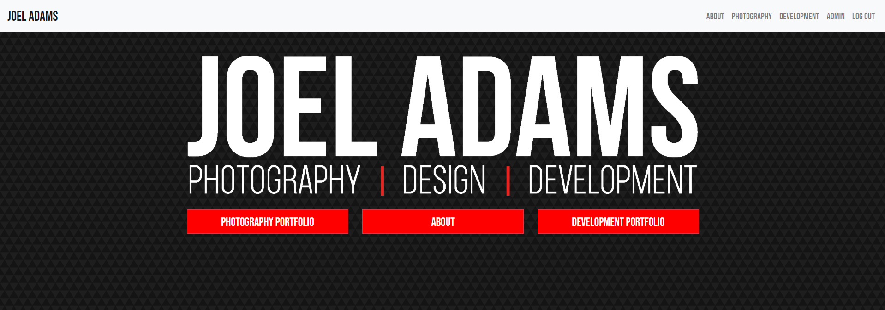
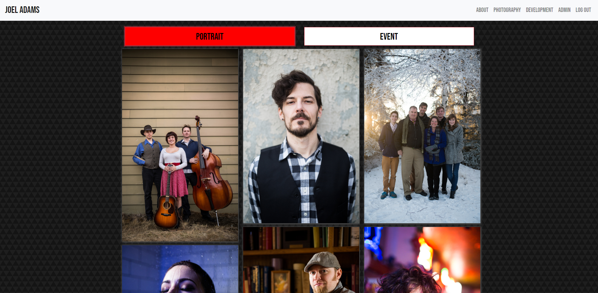
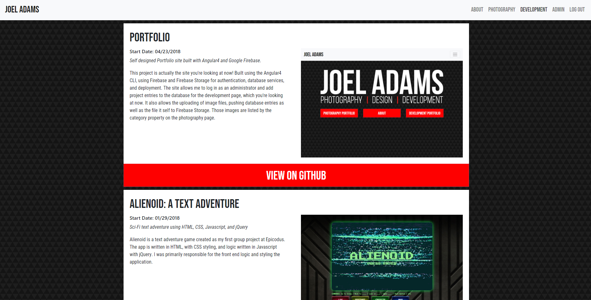
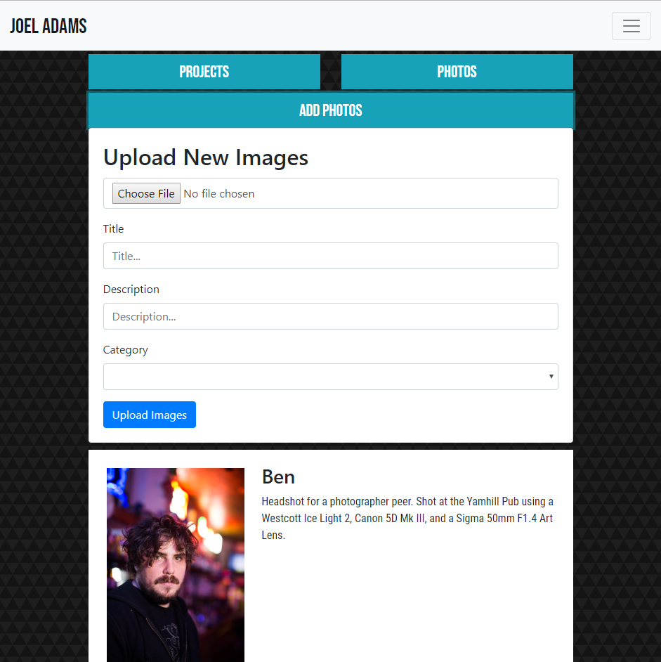

# Joel R Adams' Portfolio

Joel Adams' Portfolio Website

#### By **Joel Adams**

## Description

 Built using the Angular4 CLI, using Firebase and Firebase Storage for authentication, database services, and deployment. The site allows a user to log in as an administrator and add project entries to the database for the development page, which you're looking at now. It also allows the uploading of image files, pushing database entries as well as the file it self to Firebase Storage. Those images are listed by the category property on the photography page.

 
 Landing page screenshot

 
 Photography Portfolio page showing dynamically organized gallery view

 
 Development Portfolio screenshot

 
 Image uploading form in Admin component, also shows bootstrap collapsing navbar on smaller screen.

*GitHub repo:* https://github.com/joelaphoto/GummiBearKingdom *Live Site:* https://www.joelradams.com

## Setup/Installation Requirements
Requires Node.Js

1. Download or clone Github respository.
2. Create a file called api-keys.ts in src/app/
3. Login to Firebase and create a project, select add to web app, and copy the provided code formatted as the following into api-keys.ts:
```
export const config = {
  apiKey: 'XXXXXXXXXXXXXXXXXX',
  authDomain: 'XXXXXXXXXXXXXXXX',
  databaseURL: 'XXXXXXXXXXXXXXXX',
  projectId: 'XXXXXXXXXXXXXXXX',
  storageBucket: 'XXXXXXXXXXXXXXX',
  messagingSenderId: 'XXXXXXXXXXXXXXX'
};
```
2. Run $ npm install in command line to restore dependencies.
3. Run $ ng serve to run development server.

## Known Bugs
* No known bugs at this time.

## Technologies Used
* Node.js
* Angular
* Javascript
* Atom
* Webpack

## Support and contact details

_Please contact  the creator through Github.com: joelaphoto_

### License

*{This software is licensed under the MIT license}*

Copyright (c) 2018 **Joel Adams**
